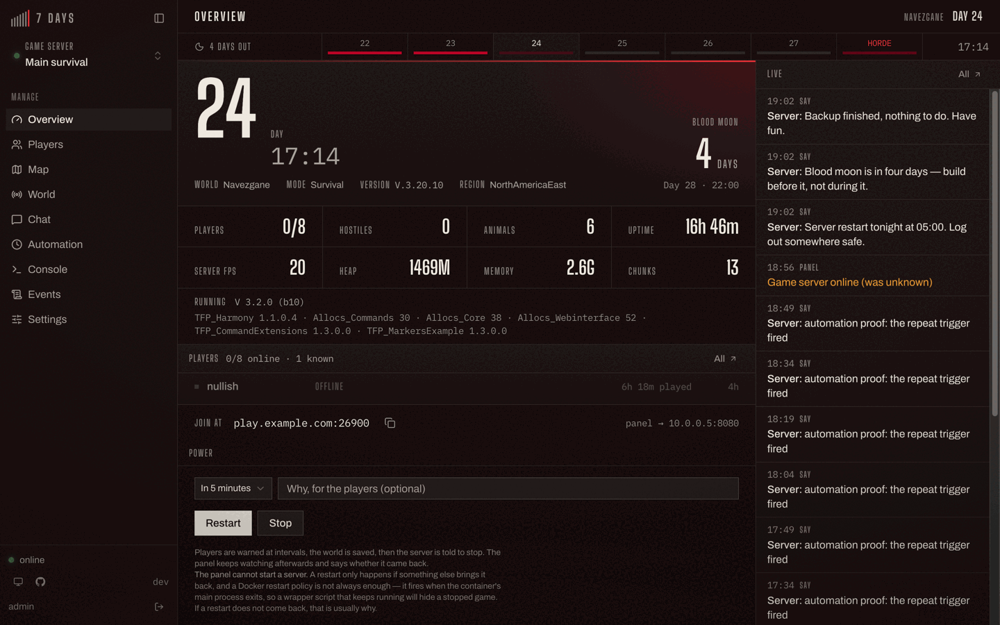
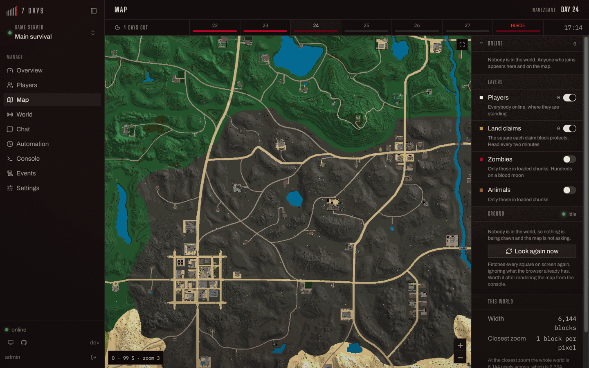
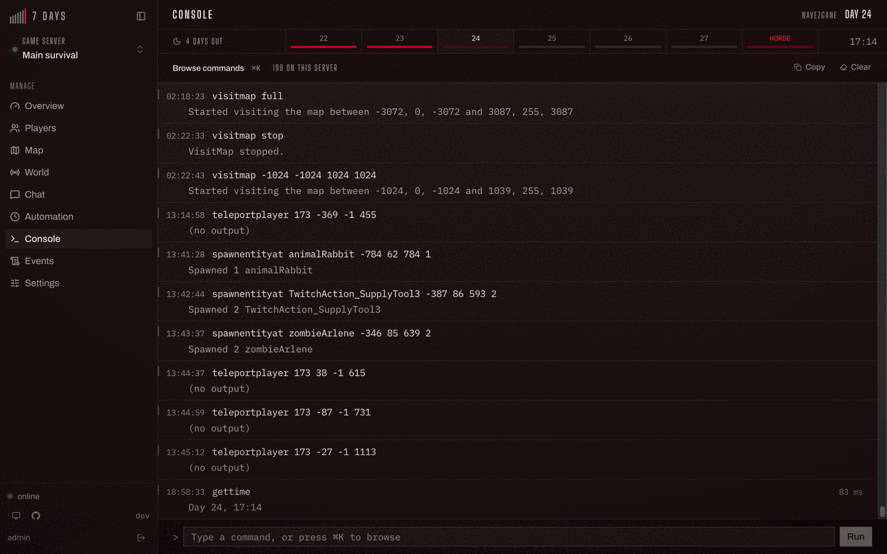
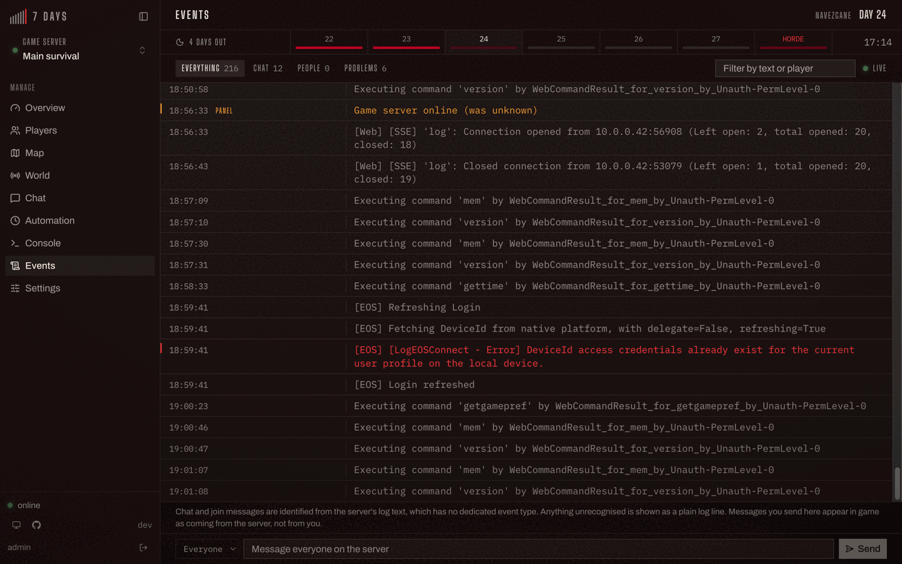
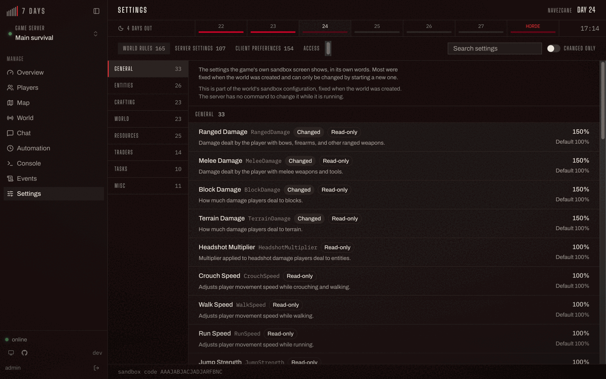

# 7dtd-panel

A self-hostable web admin panel for **7 Days to Die** dedicated servers.
Go backend, React frontend, one binary, one container.

> **Early days.** This is pre-1.0 and the version number means it: things
> may move between releases. It is run daily against a live server, but it
> has not been through many hands yet. See [what is not yet
> proven](#what-is-not-yet-proven).

The browser never talks to the game server. The API token lives only in the
panel and every game call is proxied, so nothing that reaches a browser tab
can be replayed against your world.

---

## What it does

- **Overview** — who is on, what the world is doing, how hard the server is
  working, and how long until the blood moon.
- **Players** — a page per player: teleport, give, buff, XP, private
  messages, inventory, kick, ban, admin levels, whitelist.
- **World** — the clock as a dial you drag, weather you can force, spawns,
  hordes, airdrops, broadcasts.
- **Chat commands** — the panel answers players in game. `!day`,
  `!bloodmoon`, `!players`, `!kit starter`, and any command you write
  yourself. Each one is off until you switch it on, with its own audience
  and cooldown.
- **Automation** — things that happen with nobody watching: a nightly
  restart with countdown warnings, a save when the last player leaves, a
  broadcast half an hour before the horde arrives. That last one is worked
  out from your world's own day length, so it lands at the right moment
  whether your days run for thirty minutes or ninety.
- **Console** — every command the server has, with completion and history.
- **Events** — chat, joins, deaths and the raw log, live.
- **Settings** — all 287 game preferences, grouped and labelled with the
  game's own words rather than raw numbers.

Several game servers at once, each fully separate.

## What it looks like

The overview: the day at the size the day deserves, the blood moon
countdown, server load, who is on, and the live feed down the side.



The map is the game's own tiles, proxied through the panel, with players,
land claims, zombies and animals drawn over them. Right-click anywhere to
teleport somebody there or spawn something.



The console is the server's own command list — with its own help text —
plus completion, history and the time each command took.



Events are the raw log with chat, joins and problems picked out of it, and
a box to answer from.



Settings are all 287 game preferences in the game's own words, saying which
are read-only and which have been changed from the default.




## Getting it running

You need a 7 Days to Die dedicated server with the **Allocs webinterface**
mod and its web dashboard enabled. It does not have to be on the same
machine.

### 1. Make a token on the game server

In the game server's console:

```
webtokens add panel <a-long-random-secret> 0
```

A level of 0 is maximum permission, which is what the panel's write
endpoints need. **Treat this secret like a root password** — it grants full
control of your server.

### 2. Run the panel

```bash
curl -O https://raw.githubusercontent.com/nomansheikh/7dtd-panel/main/docker-compose.yml
# edit the four values under "your game server" and "your panel login"
docker compose up -d
```

Then open <http://localhost:8080> and sign in.

<details>
<summary>Without Docker</summary>

```bash
git clone https://github.com/nomansheikh/7dtd-panel.git
cd 7dtd-panel
cp .env.example .env    # fill it in
make build              # builds the UI and embeds it in the binary
./bin/7dtd-panel
```

</details>

## Configuration

Environment variables only. There is no config file to mount.

| Variable | Default | What it is |
| --- | --- | --- |
| `SDTD_HOST` | — | Where the panel reaches the game server |
| `SDTD_API_PORT` | `8080` | The game server's web API port |
| `SDTD_API_SCHEME` | `http` | `https` only if that API is behind TLS |
| `SDTD_API_TOKEN_NAME` | — | The name from `webtokens add` |
| `SDTD_API_TOKEN_SECRET` | — | The secret from `webtokens add` |
| `PANEL_ADMIN_USERNAME` | `admin` | Your panel login |
| `PANEL_ADMIN_PASSWORD` | *required* | Reconciled on every boot — see below |
| `PANEL_PORT` | `8080` | Port the panel listens on |
| `PANEL_DB_PATH` | `/data/panel.db` | Mount a volume here |
| `PANEL_ALLOW_DESTRUCTIVE` | `true` | `false` refuses `shutdown`, `killall` and `worldchunkreset` everywhere |
| `PANEL_TRUST_PROXY` | `false` | `true` only behind something that sets `X-Forwarded-For` |
| `PANEL_POLL_INTERVAL` | `5s` | How often the game server is polled |
| `PANEL_FAILURE_THRESHOLD` | `3` | Failed polls before a server is called offline |
| `PANEL_SESSION_TTL` | `168h` | How long a login lasts |
| `PANEL_LOG_LEVEL` | `info` | `debug`, `info`, `warn`, `error` |
| `PANEL_LOG_FORMAT` | `json` | `json` or `text` |

The `SDTD_` variables are optional as a set. Set none of them and the panel
starts with nothing to manage and asks for a game server on first run, which
is the shorter path if you would rather not paste a token into a compose
file. Set any one of them and the rest become required, because a half-filled
environment is a typo rather than a choice.

`PANEL_ADMIN_PASSWORD` is reconciled into the database on every boot, so
changing it and restarting resets the password. There is no password change
in the UI — this is the way to do it.

For several game servers, see the commented section in
[`.env.example`](.env.example).

## What is not yet proven

Everything here works against the server it was built on. These parts have
not been exercised anywhere else, and are the most likely to bite:

- **Chat commands answering a live player.** Every layer is tested and the
  log formats are pinned to real output, but the loop of somebody typing
  `!day` in game and getting a reply has not been run end to end.
- **Most automation triggers.** The repeat trigger has fired for real
  against a live server. The daily, game-hour, blood moon, uptime, join,
  leave, death and empty triggers are covered by tests rather than by having
  happened.

## Things worth knowing

- **Copy buttons do nothing over plain HTTP on a LAN.** The clipboard API
  needs a secure context, so it works on `localhost` and over HTTPS, and
  silently fails on `http://192.168.x.x`. That is the browser, not the
  panel. Put it behind TLS if you want copy to work from another machine.
- **The panel is not a firewall.** Anyone who can reach it and sign in can
  do anything your token can. Put it on a private network or behind a
  reverse proxy with TLS; do not expose it to the internet as-is. What
  counts as a vulnerability, and how to report one, is in
  [SECURITY.md](SECURITY.md).
- **A bind mount needs chowning; a named volume does not.** The panel runs
  as uid 65532, and `docker compose up` with the named volume above just
  works. If you swap it for a host path, `chown 65532:65532` that directory
  first or SQLite cannot create its database.
- **Back up `panel.db` before upgrading.** Migrations are forward-only by
  design, so an older image cannot make sense of a newer database. It is one
  file; see [releasing](docs/releasing.md#upgrading-and-why-downgrading-does-not-work).
- **The map needs a `serverconfig.xml` change the panel cannot make.**
  `EnableMapRendering` is read at startup, so turning it on means editing the
  config and restarting the game server; `setgamepref` at runtime changes the
  reported value without starting the renderer. With it off, the map page says
  so instead of showing an empty world. With it on, tiles only exist where
  somebody has been — `visitmap` draws the rest.

## Versions

Pre-1.0, so `0.MINOR.PATCH`, and the number is worked out from the commit
messages rather than chosen. Three tags are published: an exact one that
never moves, a `0.MINOR` that picks up fixes, and `latest`.

For a server you care about, pin the minor:

```yaml
image: ghcr.io/nomansheikh/7dtd-panel:0.1
```

How it all works, and what to do when a release goes wrong, is in
[docs/releasing.md](docs/releasing.md).

## Contributing

See [CONTRIBUTING.md](CONTRIBUTING.md) and the
[working agreement](AGENTS.md). Anything that renders follows
[the interface guidelines](docs/design/ui-guidelines.md).

What the game's API actually does — verified against a live server, because
its own OpenAPI spec omits two of the most useful parts — is written up in
[docs/design](docs/design/2026-09-11-7dtd-panel-design.md).

## Licence

MIT. See [LICENSE](LICENSE).
